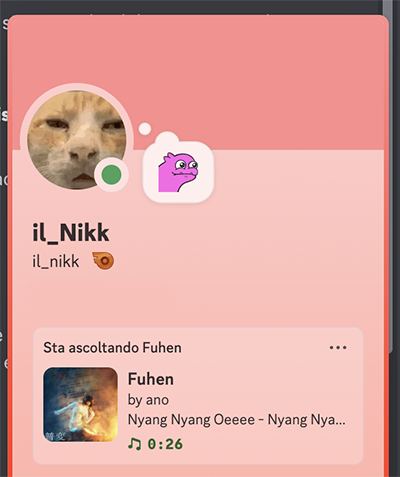

# 🎵 Music Discord Presence

A lightweight macOS menu bar app that displays your currently playing Apple Music track as Discord Rich Presence.


## ✨ Features

- 🎧 Shows "Listening to" on Discord (like Spotify!)
- 🖼️ Automatically fetches album artwork from iTunes
- 📍 Lives in your menu bar - no dock icon, no windows
- 🔄 Updates automatically when track changes
- ⚡ Lightweight and native Swift implementation

## 📸 Preview



Your Discord profile will show:
- "Listening to [Track Name]"
- Artist name
- Album artwork
- Album name (on hover)

## 🚀 Installation

### Option 1: Download (Recommended)

1. Go to the [Releases](https://github.com/ilNikk/Apple-Music-Discord-Presence/releases) page
2. Download the latest `MusicDiscordPresence.app.zip`
3. Unzip and move `MusicDiscordPresence.app` to your Applications folder
4. Double-click to run!

> ⚠️ On first launch, you may need to right-click → Open to bypass Gatekeeper (the app is not signed with an Apple Developer certificate)

### Option 2: Build from Source

1. Clone the repository:
```bash
git clone https://github.com/ilNikk/Apple-Music-Discord-Presence.git
cd Apple-Music-Discord-Presence
```

2. Build the app:
```bash
./build-app.sh
```

3. The app will be created as `MusicDiscordPresence.app`

## 🎮 Usage

1. Make sure Discord desktop app is running
2. Launch MusicDiscordPresence
3. Play music in Apple Music
4. Your Discord status will automatically update!

### Menu Bar Options

Click the 🎵 icon in your menu bar:

- **Enable Rich Presence** - Toggle the Discord status on/off
- **Reconnect to Discord** - Manually reconnect if disconnected
- **Quit** - Exit the application

## ⚙️ Requirements

- macOS 12.0 or later
- Discord desktop app (not browser version)
- Apple Music

## 🚀 Run at Login (Optional)

To have the app start automatically:

1. Open **System Settings** → **General** → **Login Items**
2. Click **+** and add MusicDiscordPresence

## 🛠️ How It Works

1. Connects to Discord via IPC socket
2. Monitors Apple Music playback via AppleScript
3. Fetches album artwork from iTunes Search API
4. Updates Discord Rich Presence every 5 seconds

## 🤝 Contributing

Contributions are welcome! Feel free to:

- Report bugs
- Suggest features  
- Submit pull requests

## 📝 License

This project is licensed under the MIT License - see the [LICENSE](LICENSE) file for details.

## ⚠️ Disclaimer

This project is not affiliated with Apple or Discord. Apple Music is a trademark of Apple Inc. Discord is a trademark of Discord Inc.
